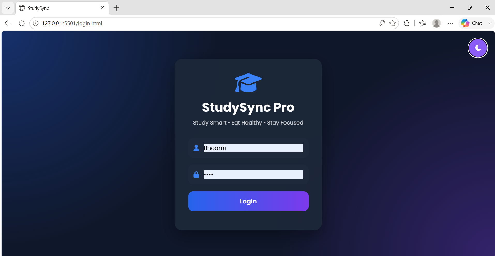
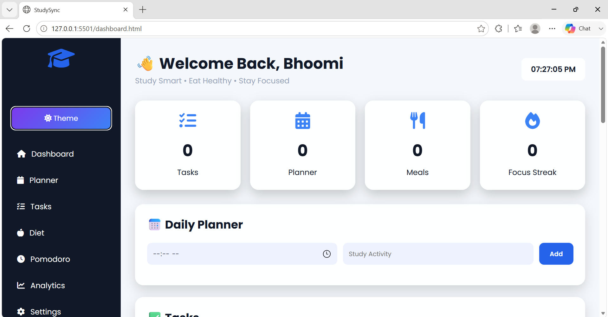
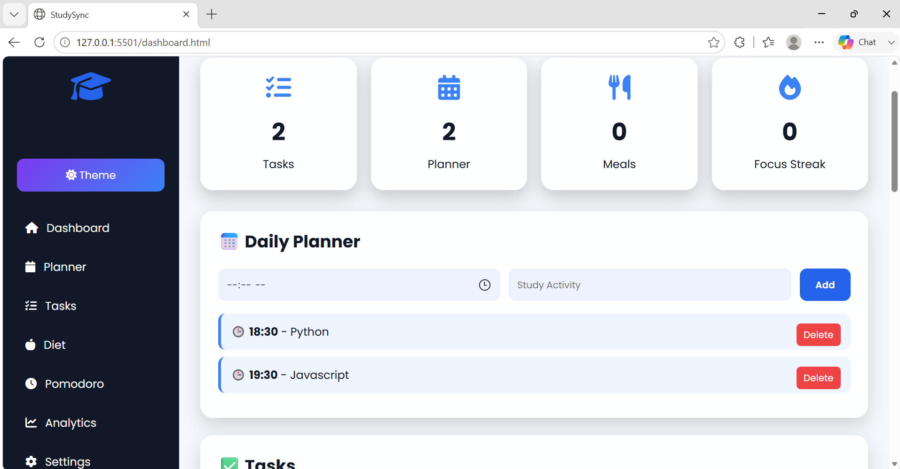
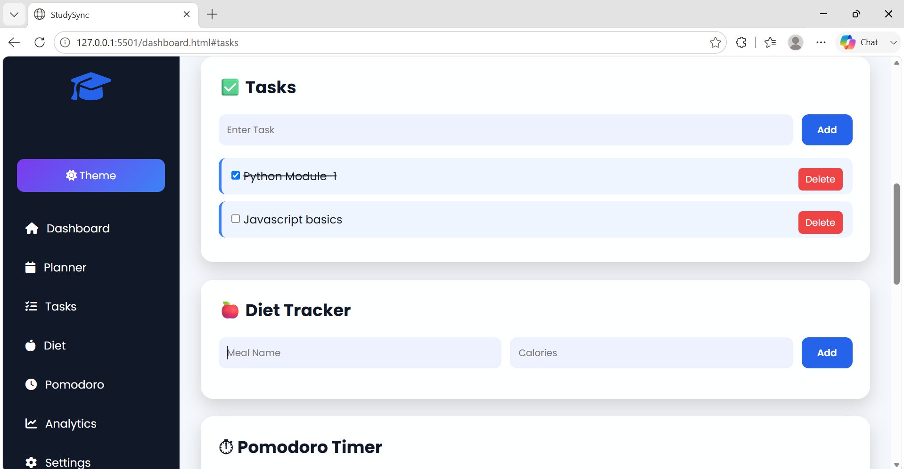
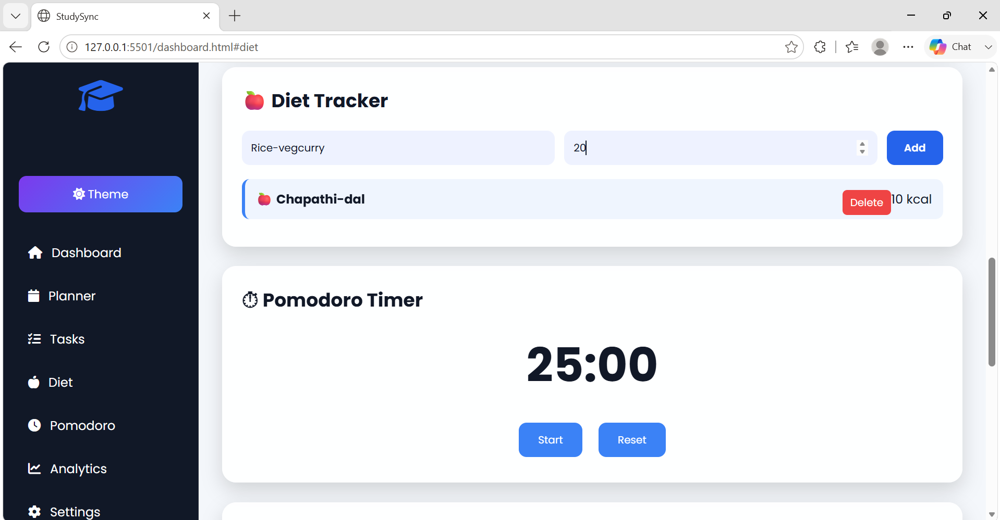
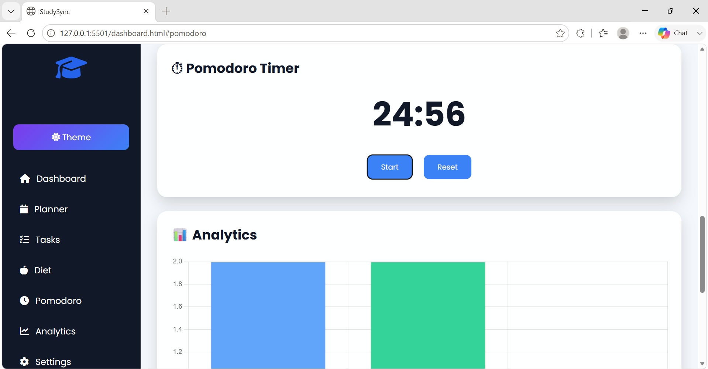
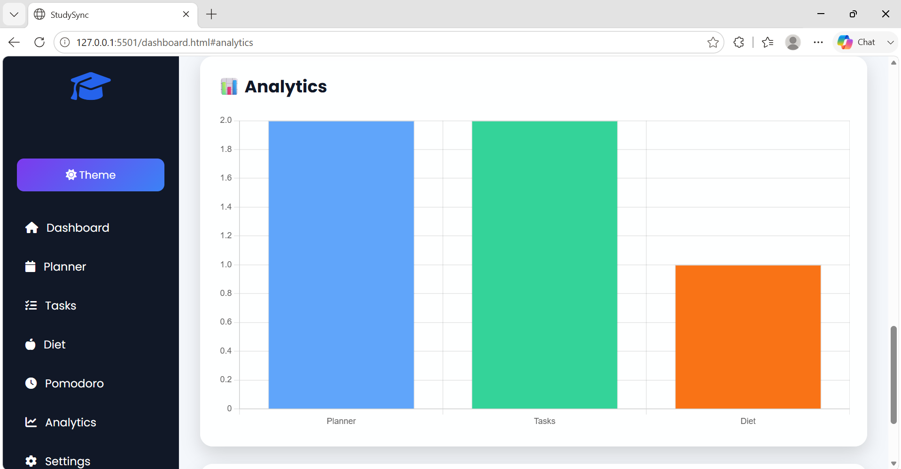
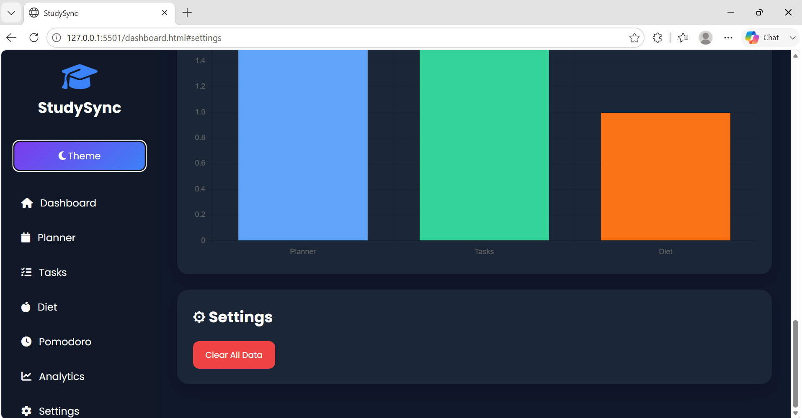

# StudySync – Student Productivity & Wellness Dashboard

> **Study Smart. Eat Healthy. Stay Focused.**

StudySync is a modern Student Productivity & Wellness Dashboard designed to help students manage their academic life, health, and daily habits in one place. It provides an intuitive interface for planning study sessions, tracking hydration, managing diet, using the Pomodoro technique, and monitoring overall productivity.

---

## Features

### Dashboard
- Clean and modern dashboard
- Quick overview of daily activities
- Responsive layout

### Study Planner
- Add study tasks
- Mark tasks as completed
- Delete tasks
- Stores data using Local Storage

### Diet Planner
- Add daily meal plans
- Track healthy eating habits
- Simple and organized interface

### Pomodoro Timer
- 25-minute focus timer
- Start, Pause, and Reset functionality
- Improves concentration and productivity

### Analytics
- Visual representation of productivity
- Displays completed tasks
- Progress charts using Chart.js

### Dark Mode
- Toggle between Light and Dark themes
- User preference saved locally

### Settings
- Personalize dashboard
- Theme customization
- Local storage support

---

## Technologies Used

- HTML5
- CSS3
- JavaScript (ES6)
- Chart.js
- Local Storage API

---

## Project Structure

```
StudySync/
│
├── index.html
├── login.html
├── style.css
├── script.js
├── README.md
```

---

## Getting Started

### Clone the Repository

```bash
git clone https://github.com/bhoomikarao24/StudySync.git
```

### Open the Project

Simply open the project folder and launch:

```
dashboard.html
```

or use **Live Server** in Visual Studio Code.

---

## Screenshots

images/









## Future Improvements

- User Authentication
- Cloud Database Integration
- Notifications & Reminders
- Calendar Integration
- Study Streak System
- Mobile App Version
- AI Study Assistant
- Cloud Backup

---

## Project Objective

The primary objective of StudySync is to improve students' productivity while encouraging healthy daily habits through a simple and interactive dashboard.

---

## Key Highlights

- Student-friendly UI
- Fully Responsive Design
- Lightweight
- Beginner Friendly
- No Backend Required
- Local Storage Support
- Interactive Charts
- Easy to Customize

---

## Author

**Bhoomika**
B.Tech Student

Passionate about Web Development, AI, and Building Student Productivity Applications.

---

## License

This project is created for educational and learning purposes.

---

## Support

If you like this project:

⭐ Star this repository

🍴 Fork the repository

📢 Share it with your friends

---

> **Study Smart. Eat Healthy. Stay Focused. 🚀**